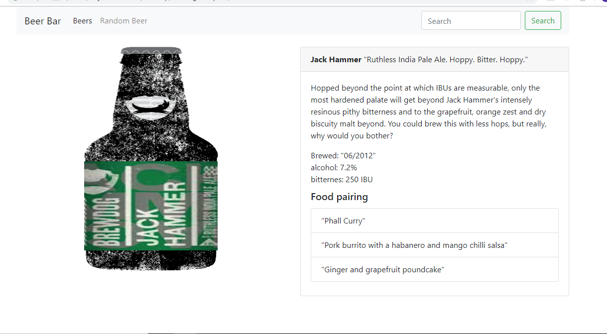

# Beer bar
## Information about all the beers in the world.

# Idea
This project should be all about beer.
We will offer the user beer information and if the user hesitate what beer to drink tonight we should offer him a random beer selection.

## Project requriments

#### Api that we should use
The Api witch you should use is:   https://punkapi.com/documentation/v2

#### Application flow

When the user comes to our page should get this screen.


When the user click on Beers navigation link should be taken to the beers page.
On this page there should be pagination, user should be given a choise to pick how much beers should be shown per page,
also the user should have a choise to sort beers by:
- Name asc/desc
- Alcohol % - abv asc/desc
- Bitterness - ibu asc/desc -- bitterness is measured in IBU
- Production Date ????? this is optional.


When the user want to see More Details for some beer should be shown the detail for that beer.
Same as more details the Random Beer navigation link should have the same page structure.
The details that needs to be shown are:
- Name
- Tagline
- First Brewed
- Description
- Image
- abv - witch is alcohol in %
- ibu - witch is bitterness in IBU
- Food Pairing




### Bonus
Bonus make search field work :)


```
if (questions)
	student.ask();

    abv: 4.5
attenuation_level: 75
boil_volume: {value: 25, unit: "litres"}
brewers_tips: "The earthy and floral aromas from the hops can be overpowering. Drop a little Cascade in at the end of the boil to lift the profile with a bit of citrus."
contributed_by: "Sam Mason <samjbmason>"
description: "A light, crisp and bitter IPA brewed with English and American hops. A small batch brewed only once."
ebc: 20
first_brewed: "09/2007"
food_pairing: (3) ["Spicy chicken tikka masala", "Grilled chicken quesadilla", "Caramel toffee cake"]
ibu: 60
id: 1
image_url: "https://images.punkapi.com/v2/keg.png"
ingredients: {malt: Array(3), hops: Array(5), yeast: "Wyeast 1056 - American Ale™"}
method: {mash_temp: Array(1), fermentation: {…}, twist: null}
name: "Buzz"
ph: 4.4
srm: 10
tagline: "A Real Bitter Experience."
target_fg: 1010
target_og: 1044
```